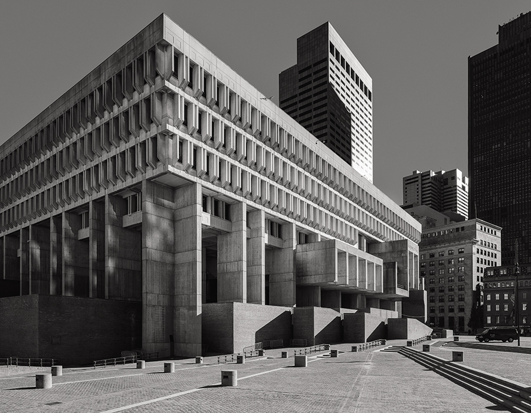
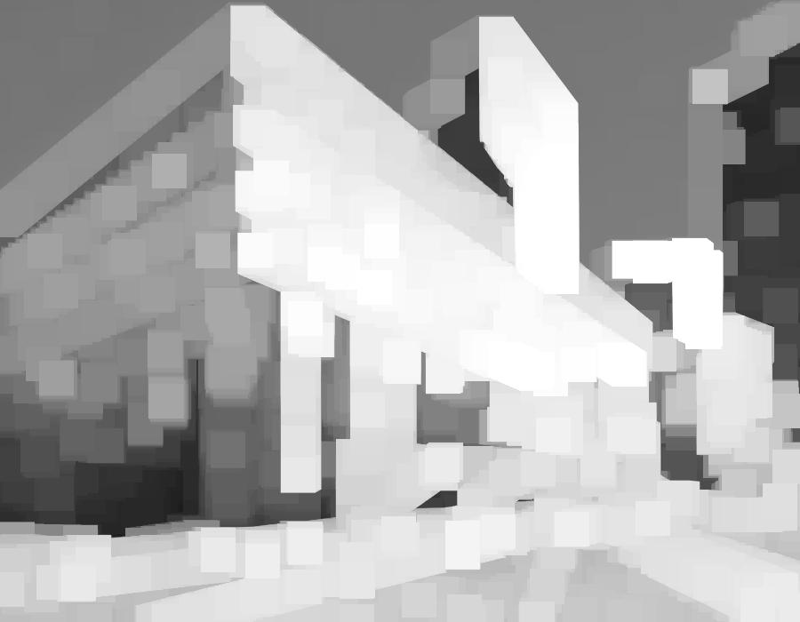
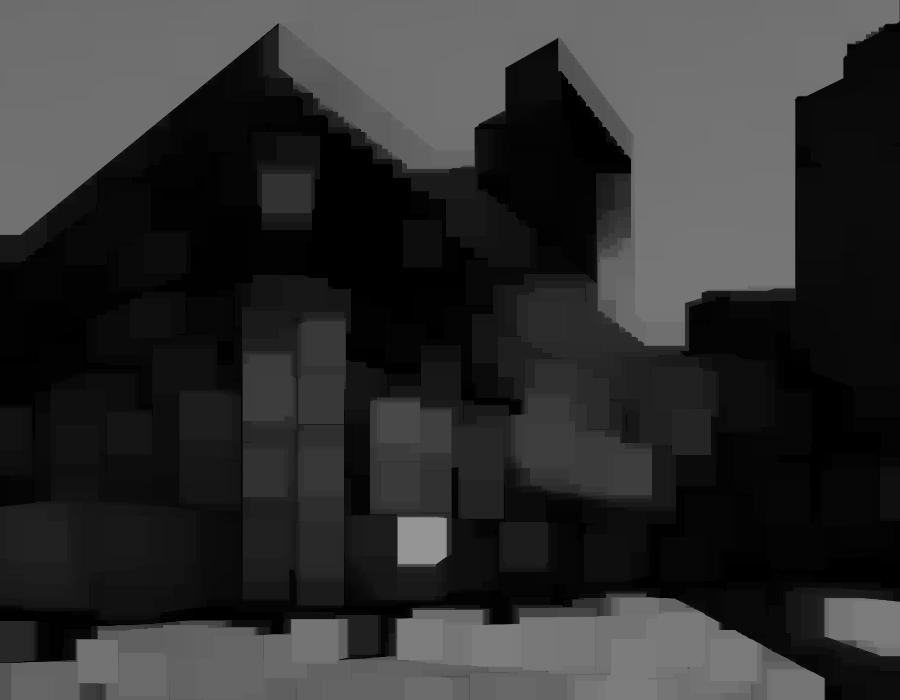

# morphol
Morphological Filters
 

| Original image | Information |
|:--:| :--: | 
|  | [900x700 image source](https://www.bostonmagazine.com/property/2019/02/12/boston-brutalism/?Property=)   All following morphological operations used window radius 20px.   Images below are variants with a random radius size from 10 to 20px.  |

| Dilation | Erosion| Closing | Opening | 
|:--:| :--: | :--: | :--: | 
|   | |  |  | 

| Dilation random | Erosion random | Closing random | Opening random | 
|:--:| :--: | :--: | :--: | 
|   | |  |  | 

